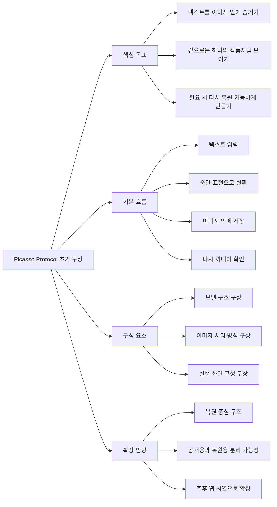

```mermaid

graph LR

    A[Picasso Protocol 초기 구상]

  

    A --> B[핵심 목표]

    A --> C[기본 흐름]

    A --> D[구성 요소]

    A --> E[확장 방향]

  

    B --> B1[텍스트를 이미지 안에 숨기기]

    B --> B2[겉으로는 하나의 작품처럼 보이기]

    B --> B3[필요 시 다시 복원 가능하게 만들기]

  

    C --> C1[텍스트 입력]

    C --> C2[중간 표현으로 변환]

    C --> C3[이미지 안에 저장]

    C --> C4[다시 꺼내어 확인]

  

    D --> D1[모델 구조 구상]

    D --> D2[이미지 처리 방식 구상]

    D --> D3[실행 화면 구성 구상]

  

    E --> E1[복원 중심 구조]

    E --> E2[공개용과 복원용 분리 가능성]

    E --> E3[추후 웹 시연으로 확장]

```