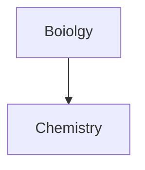

- [혁명적 메모 애플리케이션 옵시디언 설치와 사용법 정리](https://brunch.co.kr/@sparta/65)
- [마크다운 문법](https://statisticsplaybook.com/obsidian-markdown-cheatsheet/) 
- [옵시디언 공식 마크다운 문법](https://help.obsidian.md/syntax#Paragraphs)
- [MathJax 문법](https://math.meta.stackexchange.com/questions/5020/mathjax-basic-tutorial-and-quick-reference). and  [The TeX/LaTeX Extension 리스트](http://docs.mathjax.org/en/latest/input/tex/extensions/index.html) and [mathML 공식 사이트](https://developer.mozilla.org/en-US/docs/Web/MathML/Reference/Element)

---
## 쓸수있는 callout
- [!note]
- [!abstract], [!summary], [!tldr]
- [!info]
- [!todo]
- [!tip], [!hint], [!important]
- [!success], [!check], [!done]
- [!question], [!help], [!faq]
- [!warning], [!caution], [!attention]
- [!failure], [!fail], [!missing]
- [!danger], [!error]
- [!bug]
- [!example]
- [!quote], [!cite]

>[!todo]

>[!tldr]

>[!info]

>[!todo]

>[!tip]

>[!done]

>[!help]

>[!warning]

>[!fail]

>[!danger]

>[!bug]

>[!example]

>[!cite]

# TEST

## **MATH**
$$
\begin{bmatrix}
1 & a_1 & a_2 & \cdots & {a_1}^n\\
1 & a_2 & {a_2}^2 & \cdots & {a_2}^n\\
\vdots & \vdots & \vdots & \ddots & \vdots \\
1 & a_m & {a_m}^2 & \cdots & {a_m}^n
\end{bmatrix}
$$
$e^{2i\pi}=1$

$e^{i\pi}=-1$

$\bigcup \bigcap \setminus \subset \subseteq \subsetneq \supset \in \notin \emptyset \varnothing$

`\mathbb` or `\Bbb`
$\mathbb{R}, \Bbb{V}$
$\times$
$\sqrt{a}$
$a_1+a_2+\dots+a_{n-1}+a_n$
$\text{\{{x|x is Null}\}}$

$$
\begin{align}
\sqrt{37} & =\sqrt\frac{73^{2}-1}{12^2} \\
& = \sqrt{\frac{73^{2}}{12^2}\cdot\frac{73^{2}-1}{73^2}} \\
& = \sqrt{\frac{73^{2}}{12^2}}\sqrt{\frac{73^{2}-1}{73^2}} \\
& = \frac{73}{12}\sqrt{\frac{73^{2}-1}{73^2}} \\
& \approx \frac{73}{12}\left(1 - {\frac{1}{{2}\cdot{73^2}}}\right) \\
\end{align}
$$
$$
f(n) = 
\begin{cases}
n/2, & \text{if $n$ is even} \\
3n+1 & \text{if $n$ is odd}
\end{cases}
$$

$$
\begin{array}{c|lcr}
n & \text{Left} & \text{Center} & \text{Right} \\
\hline
1 & 0.24 & 1 & 125 \\
2 & -1 & 189 & -8 \\
3 & -20 & 2000 & 1+10i
\end{array}
$$
$A = \{x|x\in\mathbb{N}\}$

$$\Bigg(\bigg(\Big(\big((*boom*)\big)\Big)\bigg)\Bigg)$$

$$
\begin{align}
z & = a+bi \\
& = r(\cos{(\theta)}+i\sin{(\theta)}) \\
\\
z^n & = r^{n}(\cos{(n\theta)+i\sin(n\theta)}) \qquad\text(de\ Moivre's\ theorem)
\end{align}
$$

$$
\vec{F}=m\vec{a}
$$
$$
E=mc^2
$$
$$
\vec{F}=k\frac{{q_1}{q_2}}{r^2}
$$
$$
E=k\frac{Q}{r^2}\hat{r}
$$
$$
\begin{align}
G\frac{Mm}{r^2}
\end{align}
$$

$$
\begin{align}
\phi_E= EA \\
\\
\phi_E=E(A\cos{\theta})=\vec{E}\cdot\vec{A}
\end{align}
$$
$$AUG, UAA, UAG, UGA$$

---
# 단축키
- **읽기모드** (각주 클릭해서 이동가능!) : `ctrl + E` 
- **검색** : `ctrl + shift + F`
- **다크&라이트 모드 변환**[^1] : `ctrl + shift + D
- **볼드체** : `ctrl + B`
- **이텔릭체** : `ctrl + I`

---
[^1]:  **다크모드와** **라이트모드는** 설정에서 추가적으로 **직접**설정한 것임, 다른 설정의 옵시디언에서는 **작동하지 않음**최근 업데이트로인해 **다크모드**와 **라이트모드**가 **합병**됨
